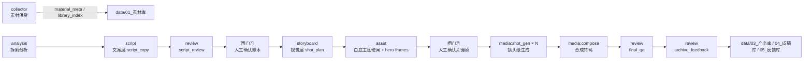

# video-agent-factory

七 Agent 绿地视频生产系统。当前仓库按 `docs/绿地搭建执行手册v2.md` 从 0 初始化；旧系统继续冻结运行，直到新系统完成 A8：连续产出 10 条合格成片。

## 一页架构

## 目录职责

- `docs/`：执行手册与项目决策记录。
- `orchestrator/`：FastAPI 总控、队列、引擎、成本记账和数据库 DDL。
- `agents/`：统一 worker 骨架与七个 Agent handler。
- `libshared/`：检查点、产物保存校验、路径规范、共享词表。
- `tools/`：LLM、ASR、SeedDance、ffmpeg、人工采集等工具适配层。
- `schemas/artifacts/`：九份 artifact JSON Schema。
- `pipeline_defs/`：流水线 YAML，当前主线为 `viral-imitate` v2。
- `knowledge/legacy/`：金子文件只读母本，搬运后不在原地重构。
- `knowledge/output-standards/`：出稿规范、合规词表、产品可视约束。
- `web/`：第一期极简闸门工作台，纯静态 + fetch。
- `config/`：运行配置、模型路由、成本价格模板。
- `data/`：四库数据根；`data/runs/` 为运行产物，默认不入 git。
- `deploy/macos/`：launchd 单机部署脚本与 plist。
- `scripts/accept/`：A1-A8 验收脚本与测试夹具。
- `tests/`：单元测试与契约反例 fixture。

## 当前块 0 状态

- 工程骨架已创建。
- `docs/绿地搭建执行手册v2.md` 已归档到仓库。
- 金子文件搬运仍是人工关卡：按手册第 2 章逐项复制，完成后再提交 `genesis: gold assets`。
- 第一阶段只引入 Python 3.11+；Node/Remotion 等到明确需要时再加。

## 不可破坏边界

- `data/01_素材库`、`data/03_产出库`、`data/04_成稿库`、`data/05_反馈库` 的语义不改。
- 产物落盘只能走 `libshared.artifacts.save_artifact`。
- 产品可见镜头必须使用可追溯的 approved 产品身份图或用图步骤图；白底主图校验是硬闸门。
- 竞品内容只用于结构、节奏、钩子和观众洞察，不进入消费者可见脚本或画面。
- handler 禁止 import `orchestrator.*`；任务状态只由 engine/queue 推进。
