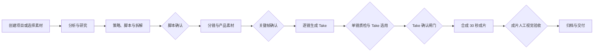

# 视频内容工厂

面向海外产品短视频团队的中文 Agent 工作台。它把产品素材、TikTok 参考内容、研究分析、脚本、分镜、逐镜生成、人工验收和 720P 交付组织为可追踪的生产链路；素材、脚本、分镜和单镜生成也可以在各自页面独立使用。

## 能做什么

- **素材采集**：后台按关键词、账号或话题主动采集 TikTok 参考内容；下载入库时保留链接、封面、标题、简介、转写和分析结果。已知链接可手动补充导入。
- **内容生产**：生成可编辑的中文策略、脚本、场景、动作、剧情推进、30 秒分镜和视频 Prompt。
- **镜头制作**：每镜生成多个 Take，人工填写返工说明后生成新候选，再完成单镜质检与选用。
- **质量交付**：FFmpeg 合成为固定 720×1280 成片，抽帧与人工目检共同决定是否允许归档交付。
- **多用户治理**：登录分流到内容生产工作台和后台管理平台；后台可审核注册、管理成员、重置密码、查看项目、失败任务、成本和后端配置状态。

## 工作流



人工闸门依次为 `script_gate`、`hero_gate`、`take_gate` 和成片人工视觉验收。任何一项未完成，系统不会自动进入交付。

脚本新产物统一使用 `voiceover_zh`；读取历史项目时仍兼容 `voiceover_en`。`strategy_brief.product_guardrails` 为可直接消费的嵌套 JSON 对象，不再把 JSON 二次转义成字符串。研究、策略、脚本和分镜面向操作员的内容均要求简体中文。生产项目使用五个 6 秒段；独立脚本支持 15/30/45/60 秒和多种结构，可逐段编辑、保存修订，再无损保留原稿并适配为 30 秒生产项目。

闸门放行接口 `POST /api/v2/gates/approve` 的标准字段为 `gate`（如 `script_gate`）；旧客户端的 `stage` 字段暂时保持兼容。缺少或传入未知闸门时，接口返回中文 422 提示。

## 两种运行模式

| 模式 | 用途 | 模型调用 | 结果 |
| --- | --- | --- | --- |
| 演练模式（默认） | 新人培训、页面走查、流程回归 | 不调用外部模型 | 可完整走完 Take 选择、合成、质检与交付流程；产物仅用于演练，不可外发 |
| 真实运行 | 真实生产 | 调用豆包与 Seedance，可能产生费用 | 创建前会检查 `DOUBAO_API_KEY` 与 `SEEDANCE_API_KEY`，缺失时直接拒绝创建 |

## 720P 交付约束

交付视频固定为：`720×1280`、9:16、30fps、H.264/AAC、`yuv420p`、`faststart`。目标时长为 30 秒，最终质检允许 ±2 秒。模型原始输出会在 FFmpeg 合成阶段统一归一化；分辨率、音频、可播放性、抽帧数量或人工验收任一失败都会阻断归档。

## 快速开始

### 1. 安装

```powershell
python -m venv .venv
.\.venv\Scripts\Activate.ps1
pip install -r requirements.txt
pip install -r requirements-tiktok.txt
```

### 2. 配置

复制 `.env.example` 为 `.env.local`。真实密钥、TikTok Cookies 和用户密码只放在服务器环境或 `.env.local`，绝不提交 Git。

```dotenv
# 真实模型，仅真实运行需要
DOUBAO_API_KEY=
SEEDANCE_API_KEY=

# 内网登录
VAF_AUTH_ENABLED=true
VAF_SESSION_SECRET=至少32位随机字符串
VAF_OPERATOR_USER=operator
VAF_OPERATOR_PASSWORD=强密码
VAF_ADMIN_USER=admin
VAF_ADMIN_PASSWORD=强密码
# 允许新用户提交账号申请，由管理员在后台审核
VAF_SELF_REGISTRATION_ENABLED=true

# HTTPS 反向代理环境设为 true；直接 HTTP 内网调试必须显式保持 false
VAF_COOKIE_SECURE=true
```

### 3. 预检与启动

```powershell
python scripts/deployment_preflight.py --env-file .env.local
uvicorn orchestrator.api:app --host 0.0.0.0 --port 8790
```

预检会检查 FFmpeg、yt-dlp、Playwright Chromium、SQLite WAL、素材/运行持久卷、模型配置和安全配置。内网部署未开启 `VAF_AUTH_ENABLED` 或 session 密钥不足 32 位时预检会失败。`VAF_COOKIE_SECURE=true` 需要 HTTPS；若直接使用 HTTP 内网地址，设为 `true` 会导致浏览器不发送 Cookie。

打开 `http://服务器地址:8790/`，选择“内容生产工作台”或“后台管理平台”。健康检查：

```powershell
Invoke-RestMethod http://127.0.0.1:8790/healthz
```

## 使用指南

### 内容生产工作台

1. 默认选择**演练模式**，先熟悉完整工作流；真实模式仅在后台显示模型配置完成后使用。
2. 在“素材采集”设置主动采集任务，或导入已知 TikTok 链接；采集素材保存在本地素材库，项目可从素材直接发起。
3. 在“脚本”逐段编辑场景、动作、剧情推进和中文旁白，保存后通过脚本闸门。
4. 在“分镜”调整镜头描述、Prompt 与时长，核对产品身份锚点后确认关键帧闸门。
5. 在“制作”中为每镜生成候选 Take。预览后通过单镜质检；若不满意，在同镜的“返工说明”中写清产品、温标、倒液或连续性问题，再生成新 Take。
6. 每镜选用一个通过质检的 Take，确认 Take 闸门后合成成片。
7. 在成片人工视觉验收中确认产品外观、无虚构 Logo、`98°F`、正确倒液方向与人物/场景连续性，全部通过后下载 zip 与运行报告。

### 后台管理平台

- 查看项目数量、成本、存储、失败任务和采集/模型后端状态。
- 审核账号申请，创建、启用/停用成员，或重置成员密码。
- 真实运行前先确认豆包、Seedance、TikTok 下载与 Cookies 的配置状态。
- 服务状态区区分“探针通过”“待验证”“可选未启用”“依赖缺失”和“异常”：存在密钥不等于真实调用已经成功，可选后端未启用也不等于系统故障。
- 后台显示当前 Git 短提交号；容器镜像没有 `.git` 目录时，可由 CI/CD 设置 `VAF_BUILD_VERSION`，用于确认浏览器访问的是哪一版服务。

## TikTok 采集与服务器部署

自动采集优先使用后台任务；手动链接仅用于补充。可在 `.env.local` 预置首个后台任务：

```dotenv
VAF_AUTO_COLLECT_ENABLED=true
VAF_AUTO_COLLECT_TARGET_TYPE=keyword
VAF_AUTO_COLLECT_TARGET=heated cup
VAF_AUTO_COLLECT_PROVIDER=auto
VAF_AUTO_COLLECT_LIMIT=3
VAF_AUTO_COLLECT_INTERVAL_MINUTES=60
# true 执行真实下载与分析；false 仅演练采集
VAF_AUTO_COLLECT_REAL=true
```

关键词和话题采集默认优先使用 Playwright 浏览器搜索，结果经过关键词相关度、播放量和内容质量排序；随后由 `yt-dlp` 下载视频、封面和字幕，本地 ASR 在无字幕时补充转写。`TikTokApi`、Apify 和人工直链保留为降级通道。

服务器上建议为 TikTok 服务账号导出持久化 Cookies，并设置：

```dotenv
TIKTOK_COOKIES_FILE=/data/secrets/tiktok-cookies.txt
TIKTOK_WORKER_TIMEOUT_SEC=75
TIKTOK_BROWSER_SEARCH_BROWSER=chromium
TIKTOK_SEARCH_WAIT_MS=12000
TIKTOK_BROWSER_SEARCH_TIMEOUT_SEC=90
TIKTOK_BROWSER_SEARCH_RETRIES=3
TIKTOK_DOWNLOAD_TIMEOUT_SEC=120
TIKTOK_SEARCH_CACHE_PATH=data/runtime/tiktok-search-cache.json
TIKTOK_SEARCH_CACHE_MAX_AGE_SEC=86400
VAF_TIKTOK_ENRICH_LIMIT=5
VAF_TIKTOK_METADATA_TIMEOUT_S=15
```

`VAF_TIKTOK_ENRICH_LIMIT` 控制每次补查真实播放量、作者和标题的候选数量，`VAF_TIKTOK_METADATA_TIMEOUT_S` 限制单条元数据补查等待时间；默认值优先保证前台响应，后台定时采集可按网络情况适度调高。Cookie 过期后应重新导出 Netscape Cookie 文件并重启采集 Worker。
实时搜索成功后会保存最近一次真实结果。TikTok 临时返回空页时，系统可在 `TIKTOK_SEARCH_CACHE_MAX_AGE_SEC` 有效期内使用缓存继续任务，并将素材标记为 `cached_browser_search`，不会冒充实时发现。

Cookies、`TIKTOK_MS_TOKEN` 和 API Key 不应进入仓库或镜像。TikTok 的可访问性会受地区、登录状态、Cookie 有效期和平台策略影响；系统会保留人工链接导入作为降级入口。

管理员可在“管理中心 → 部署就绪度”上传 Netscape 格式 Cookies 文件。服务端只保存到配置的秘密目录，不向前端回传内容；上传后应立即运行“检测采集”。同一区域会显示鉴权、会话密钥、HTTPS Cookie、FFmpeg、Playwright、OCR、ASR 和持久目录的真实就绪状态。

无字幕视频需要额外配置火山语音识别，不能复用豆包文本或 Seedance 密钥：

```dotenv
# 新版控制台优先使用这一项
VOLCENGINE_ASR_API_KEY=
# 旧版控制台使用以下两项
VOLCENGINE_ASR_APP_KEY=
VOLCENGINE_ASR_ACCESS_KEY=
```

TikTokApi 浏览器采集运行在隔离子进程中，超过 `TIKTOK_WORKER_TIMEOUT_SEC` 会终止并返回可读错误，避免主服务被浏览器卡死。TikTokApi 对关键词的能力更接近话题标签发现；需要严格按自然语言关键词检索时，应配置 `APIFY_API_TOKEN`，并保留账号采集、Cookies 下载和人工直链作为降级路径。

关键词任务会自动展开为产品词、品类词、中英文场景词，合并去重后按相关度、播放量、互动率和元数据完整度排序。生产入库默认要求相关度至少 `50%`；供应商返回播放量时还要求至少 `5000` 次播放，可分别通过 `VAF_TIKTOK_MIN_RELEVANCE` 和 `VAF_TIKTOK_MIN_PLAYS` 调整。低分素材只记录在任务明细中，不下载、不进入生产素材库。

真实素材必须同时具备本地视频、封面、真实字幕或 ASR 转写、结构化镜头拆解才会标记为可生产。视频简介不会再被当作转写。无字幕视频需配置火山 ASR；未配置时素材会留存在待补齐区，并明确显示缺少转写和拆解。

不使用云端 ASR 时，可运行 `pip install -r requirements-local-asr.txt`，并设置 `VAF_LOCAL_ASR_ENABLED=true`。默认使用 Faster-Whisper `base/int8/CPU`，首次运行会下载模型到 `VAF_LOCAL_ASR_CACHE_DIR`，后续可离线转写。模型缓存和 `secrets/` 均已排除 Git。

视频抽帧温标检查使用 Tesseract OCR。若部署机已安装但程序不在系统 `PATH`，请在 `.env.local` 中设置 `VAF_TESSERACT_CMD` 为 `tesseract` 可执行文件的绝对路径；Windows 默认安装目录也会被自动识别。OCR 只提供自动证据，产品外观、98°F、使用方向和人物连续性仍须通过人工终审。

## 验收与开发

### 成本护栏

新建项目默认使用 `budget_mode=enforce` 和 `budget_cny=35`。每个真实计费节点在调用供应商前，都会用当前已记账成本加本次调用估算进行检查；预计超出项目预算时，任务进入 `blocked`，不会继续调用模型。`observe` 仅用于管理员受控排查，不建议用于多人生产环境。

`config/orchestrator.yaml` 中的价格按火山引擎公开价格与实测 token 用量估算，并非供应商结算账单。上线后应根据企业火山引擎账单，通过 `VAF_PRICE_<TOOL>_CNY` 定期覆盖校准。部署预检会检查模型供应商估价均大于零、本地 FFmpeg 估价不小于零，并确认默认预算模式为 `enforce`。

采集中心创建的任务写入 SQLite `collection_jobs`，由 API 后台 Worker 持续领取；关闭浏览器不会中断任务。Worker 使用数据库租约和心跳避免重复执行，进程异常后过期租约会自动回收，临时故障按退避策略重试。默认 `VAF_COLLECTION_WORKER_ENABLED=true`；只有部署独立采集 Worker 时才应在 API 进程中显式关闭。

终态任务会自动清理，避免后台任务卡片持续堆积。默认已完成任务保留 7 天，失败、部分完成和取消任务保留 14 天，每小时清理一次；可通过 `VAF_COLLECTION_SUCCEEDED_RETENTION_DAYS`、`VAF_COLLECTION_FAILED_RETENTION_DAYS` 和 `VAF_COLLECTION_CLEANUP_INTERVAL_SECONDS` 调整。清理仅删除队列任务及其临时候选记录，不删除已经写入素材库的视频、封面、转写、拆解成果。

真实模型验收必须保留项目运行报告、五个镜头产物、最终 720×1280 成片和人工抽帧检查结果。一次真实回归只能证明当次模型与配置可用，不能替代持续的失败率、耗时和实际账单监控。

```powershell
python -m pytest tests scripts/accept -q
node --check web/app.js
node --check web/admin.js
node --check web/login.js
python scripts/accept/run_a8_10videos.py
```

GitHub Actions 会在 push 与 pull request 时执行同一套 Python 测试与前端语法检查。`scripts/accept/report_10videos.md` 是当前代码的 mock 十视频验收报告；其中 Real Readiness 会如实反映模型密钥和价格校准状态，不代表真实模型成片已验收。

真实验收至少检查：

1. 产品外观符合已批准素材，且没有模型虚构的品牌、Logo 或文字。
2. 温度只出现 `98°F`，不出现 `98°C` 或摄氏表述。
3. 恒温杯与奶瓶保持独立；液体从杯嘴倒入独立奶瓶，方向正确。
4. 人物、服装、场景和产品外观在镜头间连续。
5. 最终媒体可播放、有音频、约 30 秒且严格为 720×1280。

## 目录

- `orchestrator/`：FastAPI、队列、流程引擎、鉴权、闸门与质检。
- `tools/`：采集、LLM、视频、FFmpeg、ASR 与产品素材工具。
- `pipeline_defs/`：YAML 流程定义，包含全部人工闸门。
- `schemas/artifacts/`：结构化产物 JSON Schema。
- `web/`：中文工作台、登录和后台管理前端。
- `scripts/accept/`：端到端验收与十视频报告。
- `data/01_素材库/`：随仓库提交的示例产品素材；`data/05_反馈库/`：反馈样本。`data/runs/`、SQLite 文件和运行交付物不提交 Git。

## 安全边界

产品素材必须来自可追溯的批准素材库。参考视频只用于研究节奏和结构，不能直接复制品牌表达。系统不会因为媒体文件“可播放”就自动交付：产品身份、正确使用方式、Take 选用和成片人工目检都必须通过。内网服务应置于 HTTPS 反向代理之后，并启用登录、强 session 密钥和安全 Cookie。
