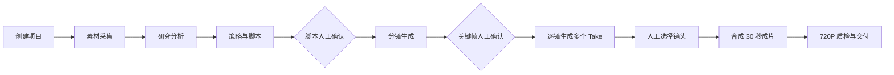

# 视频内容工厂

面向海外短视频团队的 Agent 视频生产系统。系统把产品素材、参考视频、研究分析、脚本、分镜、AI 镜头、人工审核和成片交付组织成一条可追踪的生产链路，同时允许各 Agent 在对应页面独立运行。

## 系统定位

本仓库不是单一的视频生成脚本，而是一个可人工介入、可审计、可替换模型供应商的内容生产工作台：

- **素材采集**：产品素材库、TikTok 参考视频、关键词或账号采集、视频下载、封面、转写和镜头拆解。
- **研究与策略**：提取参考内容的节奏、结构、受众洞察和品牌安全边界。
- **脚本**：生成中文脚本、台词、场景、动作、剧情推进和脚本拆解，支持人工修改。
- **分镜**：生成 30 秒镜头计划、画面 Prompt、动作、运镜、时长和连续性要求，支持人工调整。
- **制作**：按镜头生成多个 Take，使用产品身份素材约束画面，并允许人工选择最佳 Take。
- **审核与交付**：抽帧检查产品外观、温标、使用方向、人物场景连续性、音频、时长和文件可播放性。

## 核心生产流程



脚本确认和关键帧确认是强制人工闸门。系统不会绕过产品身份、使用方向或成片质量检查自动交付。

## 720P 交付硬约束

所有视频生产和交付统一为：

- 分辨率：**720×1280**
- 画幅：9:16 竖屏
- 帧率：30fps
- 目标时长：30 秒，允许最终质检误差 ±2 秒
- 编码：H.264、AAC、`yuv420p`、`faststart`

模型请求不强制传递供应商不支持的分辨率枚举；模型返回的视频会在 FFmpeg 合成阶段统一缩放、补边、补音频并校验为 720×1280。最终质检发现任何非 720×1280 文件都会阻断交付。

## Agent 独立运行

除总控流程外，以下能力可以脱离项目单独使用：

| 页面 | 独立能力 | 输入 | 输出 |
| --- | --- | --- | --- |
| 素材采集 | 关键词、账号或链接采集 | 检索目标 | 素材元数据、下载文件、封面、转写 |
| 脚本 | 独立脚本生成、脚本拆解 | 中文需求或参考文本 | 中文脚本和结构化拆解 |
| 分镜 | 独立分镜生成 | 场景、人物、动作、风格 Prompt | 可编辑 30 秒镜头计划 |
| 制作 | 独立单镜生成 | 产品素材和镜头 Prompt | 720P 单镜 Take |

网页入口位于工作流左侧对应阶段；后端统一接口为 `POST /api/v2/agents/run`。

## 运行环境

- Python 3.11+
- FFmpeg
- `yt-dlp`（真实 TikTok 视频下载）
- 豆包分析、脚本、分镜和 Seedance 视频模型凭证
- 可选 ASR 服务，用于无字幕视频自动转写

安装依赖：

```powershell
python -m venv .venv
\.venv\Scripts\Activate.ps1
pip install -r requirements.txt
pip install -r requirements-tiktok.txt
```

配置 `.env.local`：

```dotenv
ARK_API_KEY=你的豆包密钥
DOUBAO_API_KEY=你的豆包分析密钥
SEEDANCE_API_KEY=你的视频生成密钥
```

密钥只放在本地环境或服务器环境变量中，不要提交到 Git。真实模式会产生模型费用；Mock 模式只用于接口和流程测试，不会生成可交付成片。

## 启动

```powershell
uvicorn orchestrator.api:app --host 127.0.0.1 --port 8790
```

打开 `http://127.0.0.1:8790/`。内网部署时，将监听地址改为服务器内网地址，并通过反向代理、访问控制和 HTTPS 保护服务。

健康检查：

```powershell
Invoke-RestMethod http://127.0.0.1:8790/healthz
```

## 测试

```powershell
pytest -q tests
node --check web/app.js
```

真实验收建议只使用恒温杯样本，并依次确认：

1. 分析、脚本和分镜内容符合产品事实。
2. 产品显示只出现 `98°F`，不出现摄氏度或 `98°C`。
3. 倒液方向正确，恒温杯和奶瓶保持为两个独立产品。
4. 人物、场景、服装和产品外观在镜头间连续。
5. 最终文件可播放、时长约 30 秒、分辨率严格为 720×1280。

## 目录说明

- `orchestrator/`：FastAPI、任务队列、流程引擎、闸门和质检。
- `agents/`：Agent worker 与处理器。
- `tools/`：采集、LLM、Seedance、FFmpeg、ASR 和素材工具。
- `schemas/artifacts/`：结构化产物 JSON Schema。
- `pipeline_defs/`：流程定义。
- `web/`：中文工作台前端。
- `data/`：运行产物、素材和交付文件，默认不提交 Git。
- `tests/`：当前有效的接口、流程和产物契约测试。

## 生产安全边界

产品素材必须来自可追溯的批准素材库。参考视频只用于分析结构和节奏，不直接复制品牌表达。任何关键帧、产品身份、使用动作或成片质检未通过时，系统必须停在人工节点，禁止自动归档交付。
