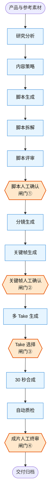
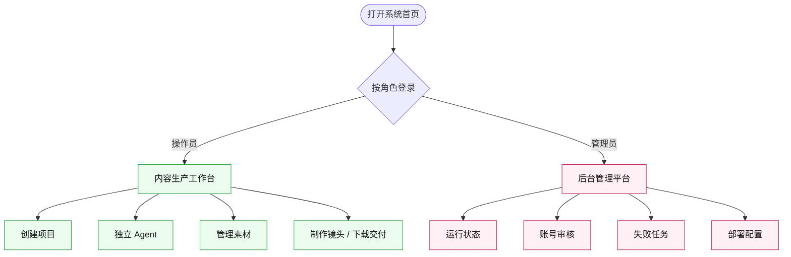
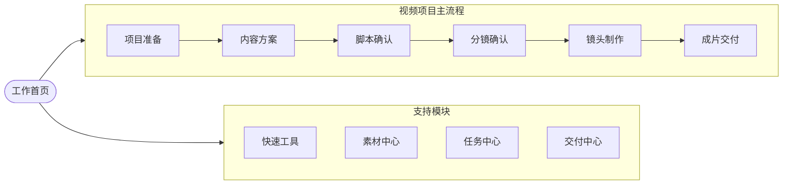
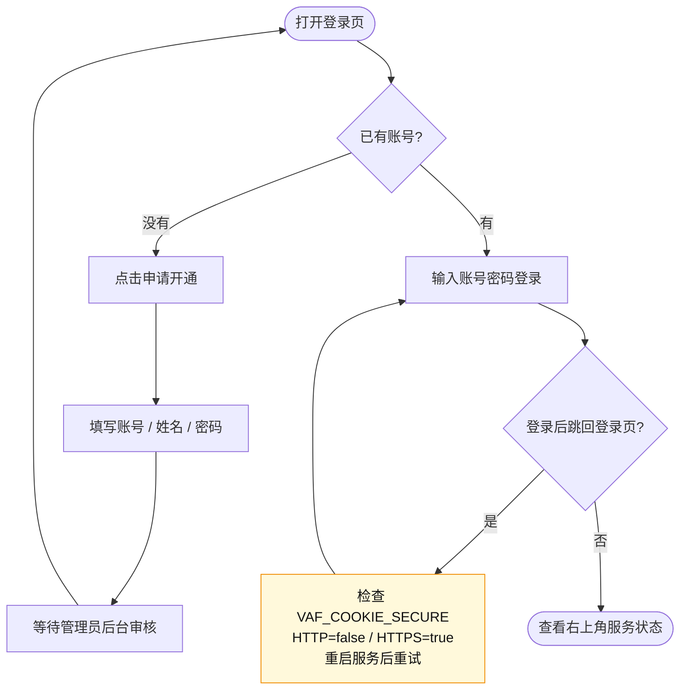
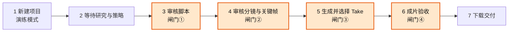
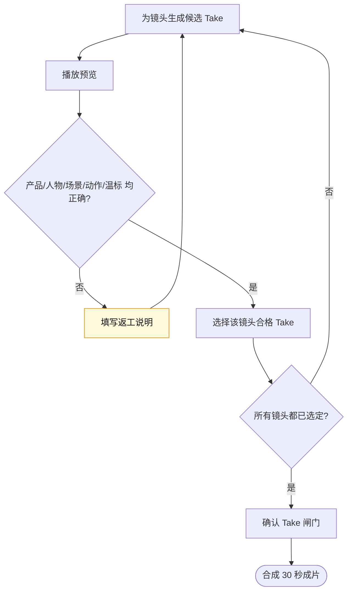
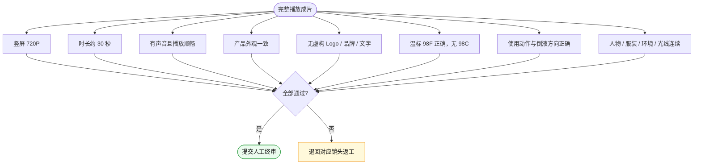
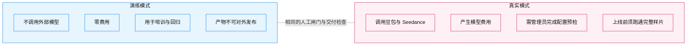
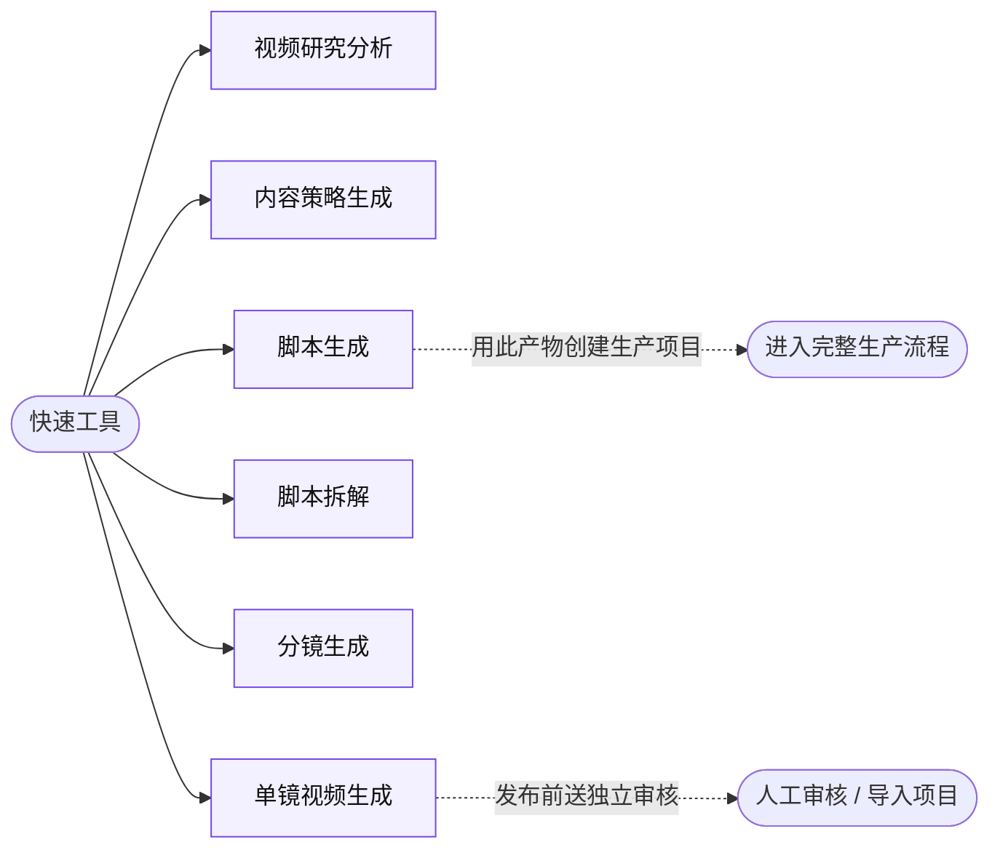
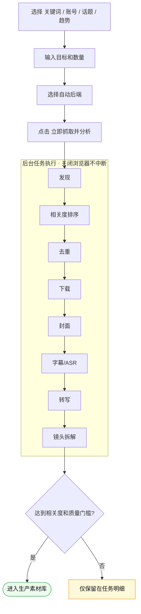

# 视频内容工厂新手使用指南

这份指南面向第一次使用系统的运营、编剧、导演、设计和审核人员。建议先用演练模式走完一次，再切换真实模式。

> 📌 本指南所有配图均为 Mermaid 流程图，可在 GitHub 或支持 Mermaid 的 Markdown 阅读器中直接渲染查看。

## 系统全景图

下图展示从素材到交付的完整链路，橙色菱形是四道**人工闸门**，只有人工放行后流程才会继续。

## 一、先认识两个入口

打开系统首页后可以进入：

- **内容生产工作台**：创建项目、使用独立 Agent、管理素材、制作镜头和下载交付包。
- **后台管理平台**：管理员查看运行状态、账号申请、成员、失败任务和部署配置。

普通使用者进入生产工作台；只有管理员需要进入后台。

工作台左侧导航分为「视频项目」主流程和「快速工具 / 素材中心 / 任务中心 / 交付中心」四个支持模块：

## 二、第一次登录

1. 使用管理员分配的操作员账号登录。
2. 没有账号时点击“申请开通”，填写账号、姓名和密码。
3. 申请提交后等待管理员在后台审核。
4. 登录后先看右上角服务状态；真实生产前再确认管理后台没有关键配置报错。

如果登录后立即跳回登录页：

- HTTP 内网调试环境应设置 `VAF_COOKIE_SECURE=false`。
- HTTPS 反向代理环境应设置 `VAF_COOKIE_SECURE=true`。
- 修改后重启服务并重新登录。

## 三、用演练模式完成第一条视频

演练模式覆盖以下七个步骤，其中第 3、4、5、6 步需要你亲自把关：

### 1. 新建项目

进入“工作首页”或“视频项目”：

1. 选择产品。
2. 运行模式选择“演练模式”。
3. 参考素材编号可以留空。
4. 点击“开始生产”。

演练模式不会调用收费模型，但会走完整的闸门、Take 选择、合成和交付流程。

### 2. 等待研究与策略完成

系统依次运行研究分析、内容策略和脚本生成。页面会显示当前节点。不要重复创建项目；任务失败时查看错误原因并点击重试。

### 3. 审核脚本

在“脚本”页检查每一段：

- 画面场景是否明确。
- 人物动作是否可拍。
- 剧情是否持续推进。
- 中文旁白是否自然。
- 产品卖点是否真实。
- 30 秒节奏是否合理。

修改后先保存，再点击“保存并通过”。不满意时填写具体返工意见，例如“钩子不够直接，前 3 秒需要先展示夜间冲奶痛点”，不要只写“重做”。

### 4. 审核分镜和关键帧

在“分镜”页逐镜检查：

- 镜头画面和脚本段落一致。
- 生成提示词包含场景、主体、动作、镜头、光线和连续性。
- 产品外观没有变化。
- 温标要求为 `98°F`。
- 倒液方向和产品使用方式正确。

确认全部镜头后通过关键帧闸门。

### 5. 生成并选择 Take

在“镜头制作”页：

1. 为每个镜头生成候选 Take。
2. 播放预览。
3. 检查产品、人物、场景、动作和温标。
4. 不满意时填写返工说明并重新生成。
5. 每个镜头选择一个合格 Take。
6. 全部选择完成后确认 Take 闸门并合成。

不要为了推进流程选择不可播放或明显错误的 Take。

### 6. 成片验收

在“成片验收”页完整播放视频，并确认：

- 竖屏 720P。
- 时长约 30 秒。
- 有声音且播放顺畅。
- 产品外观一致。
- 没有虚构 Logo、品牌和文字。
- `98°F` 正确，未出现 `98°C`。
- 使用动作、倒液方向正确。
- 人物、服装、环境和光线连续。

全部检查通过后提交人工终审。

### 7. 下载交付

在“交付归档”或“交付中心”下载：

- 最终 MP4。
- 交付 ZIP。
- 运行报告。
- 脚本、分镜和质量报告等节点产物。

演练产物仅用于培训和回归，不可对外发布。

## 四、真实模式怎么用

演练模式与真实模式走**完全相同**的人工闸门和交付检查，区别只在于是否调用收费模型：

真实模式会产生模型费用。开始前由管理员确认：

- 豆包文本模型可用。
- Seedance 视频模型可用。
- FFmpeg 与 ffprobe 可用。
- Playwright Chromium 可用。
- 预算模式为 `enforce`。
- 产品素材完整。
- TikTok、ASR 和 OCR 按当前任务需要配置。

创建真实项目后仍需完成全部人工闸门。模型返回成功不代表内容合格。

## 五、独立 Agent

进入“快速工具”，选择需要的 Agent。独立运行不会依赖当前生产项目。

### 视频研究分析

输入参考视频信息、转写或研究材料，输出受众洞察、内容结构、风险和可复用模式。

### 内容策略生成

输入产品、受众、投放平台、目标和限制，输出内容方向、钩子、卖点顺序和行动号召。

### 脚本生成

输入主题、场景、受众、产品事实、视频时长和创意要求。生成后可以逐段修改、保存和下载。

满意的独立脚本可以点击“用此产物创建生产项目”，系统会保留原稿并适配生产流程，而不是重新替换成固定模板。

### 脚本拆解

粘贴已有脚本，输出角色、节奏、场景、动作、旁白、镜头意图和制作提示。

### 分镜生成

输入脚本或自定义提示，输出可编辑镜头列表和生成 Prompt。应明确产品、场景、动作、构图、光线与连续性。

### 单镜视频生成

输入单镜 Prompt，调用视频模型生成一个候选镜头。独立生成不经过完整项目闸门，发布前应送交独立审核或导入生产项目。

## 六、TikTok 素材采集

进入“素材中心 → 素材采集”：

1. 选择关键词、账号、话题或趋势。
2. 输入目标和数量。
3. 选择自动后端。
4. 点击“立即抓取并分析”。

后台会执行发现、相关度排序、去重、下载、封面、字幕或 ASR、转写和镜头拆解。关闭浏览器不会停止任务。

一条素材要进入可生产状态，至少需要：

- 原始链接和本地视频。
- 封面。
- 标题与作者信息。
- 字幕或 ASR 转写。
- 结构化镜头拆解。
- 达到相关度和质量门槛。

低相关素材只保留在任务明细，不进入生产素材库。

### Cookies 显示待配置

1. 管理员进入“管理中心 → 部署就绪度”。
2. 点击“更新 TikTok Cookies”。
3. 上传 Netscape 格式 `.txt` 文件。
4. 点击“检测采集”。

服务器必须使用服务器内路径，不能填写开发电脑的 `D:\...` 路径。Cookies 会过期，需要定期更新。

### 后台任务清理

已完成任务默认保留 7 天，失败、部分完成和取消任务保留 14 天。系统每小时清理一次终态任务卡片，但不会删除已入库素材。

## 七、管理员日常工作

管理员应定期检查：

1. 注册申请和成员状态。
2. 失败任务及其错误原因。
3. 豆包与 Seedance 的真实探针状态。
4. TikTok 搜索、下载器、Cookies 和 ASR。
5. FFmpeg、Playwright、OCR 和持久卷。
6. 项目成本、失败率和存储占用。
7. 当前部署版本号是否与 GitHub 提交一致。

“已配置”只表示存在配置；“可用”表示真实探针成功。两者不要混淆。

## 八、常见错误处理

### 点击按钮没有反应

等待当前操作结束，刷新页面后重新打开项目。仍无反应时记录项目编号、节点、操作时间和页面提示，交给管理员查看失败任务。

### 页面一直等待

查看当前节点是否处于人工闸门。脚本、关键帧、Take 和成片终审不会自动放行。

### 视频不可预览

检查该 Take 是否生成成功、文件是否可播放以及浏览器是否能访问媒体地址。失败 Take 应重新生成，不应强行选用。

### 分镜安全预检失败

按错误提示补齐对应镜头的产品和温标约束。`98°F` 仅在需要显示温度的产品镜头中明确呈现，但禁止任何镜头生成 `98°C`。

### TikTok 抓取结果少或不相关

先确认 Cookies 与搜索探针有效，再调整关键词。优先使用产品词、品类词和使用场景组合，不要只输入过于宽泛的单词。

## 九、提交问题时需要提供什么

请提供：

- 页面和功能节点。
- 项目编号或采集任务编号。
- 操作步骤。
- 完整错误提示截图。
- 发生时间。
- 演练模式还是真实模式。

不要发送 API Key、密码、完整 Cookies 或内部素材原文件。
